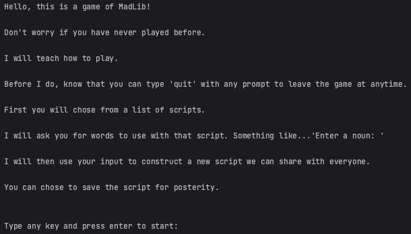

LAB:

* Lab03

PROJECT: 

* matlib_cli

AUTHOR:

* Jacob Bassett

LINKS:

* NA

IMAGES:

SETUP:

* REQUIREMENTS: 
  * iniconfig==2.0.0 
  * packaging==23.1 
  * pluggy==1.3.0 
  * pytest==7.4.2

* PORT: NA

* DATABASE_URL: NA 

* RUN: python3 madlib.py

TESTS:

* To run production tests, run the command 'pytest'

INSTRUCTIONS:

* This is a commandline tool. You can run the script with the 'python3 madlib.py' command in the terminal. Follow the prompts to play madlib. Type 'quit' to leave the game with any prompt.

PRODUCTION NOTES:

* NA